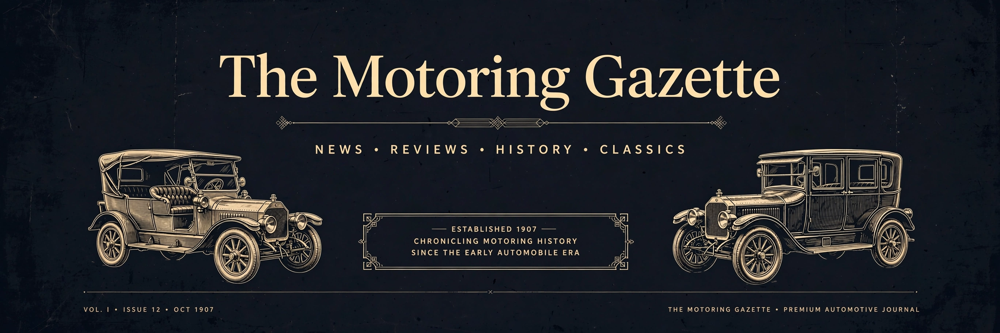
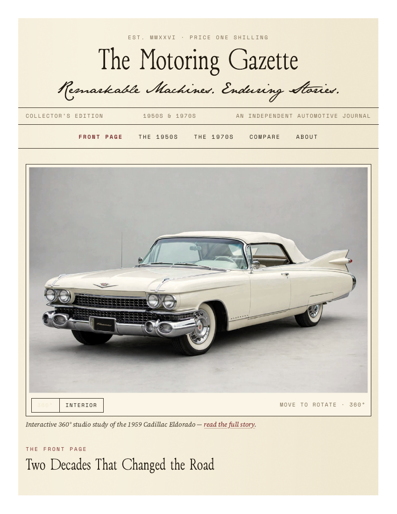

# The Motoring Gazette

> ## Status: 🟢 Completed
>
> <progress value="95" max="100"></progress>
> **Progress: 95%** — 8-car antique-newspaper site complete: profiles, 360° viewer, compare, search & filters all working. Remaining: public deployment.

<p align="center">
  
</p>


## Screenshots

<p align="center">
  
  <br />
  <em>Front page — antique-newspaper masthead, 1959 Cadillac Eldorado 360° feature.</em>
</p>

## What it is

The Motoring Gazette is a hash-routed single-page app that presents eight
verified classic-car profiles as an antique 1900s newspaper. Aged cream
paper, black ink, and serif typography dress up long-form articles, spec
panels, and galleries; the standout feature is an interactive 360° turntable
viewer built from 288 AI-generated studio frames (36 per car, 10° steps).
There are no photos of the real cars — every illustration is AI-generated and
credited as such throughout the site. Routes (`#/`, `#/1950s`, `#/car/<slug>`,
`#/compare`, `#/about`) work on any static host.

## What works (verified)

Verified by reading the source and by building the project locally:

- ✅ Hash-routed SPA with shareable article URLs — `App.tsx` + `useHashRoute` (`#/`, `#/1950s`, `#/1970s`, `#/car/<slug>`, `#/compare`, `#/about`)
- ✅ 8 verified car profiles (1957 Bel Air, 1959 Eldorado, 1955 300 SL, 1959 XK150, 1970 Challenger R/T, 1973 Carrera RS 2.7, 1974 Countach LP400, 1976 Golf GTI Mk1) — exact variants, specs with measurement standards (SAE gross / DIN / bhp), Collector's Note, source links (`src/data/cars.ts`)
- ✅ Interactive 360° car viewer — 36-frame turntables (10° steps, all 8 cars present), pointer-scrub with eased angle, flick momentum with friction decay, arrow-key glide, lazy preload via IntersectionObserver, no autoplay; reduced-motion users get direct snapping (`src/components/CarViewer360.tsx`)
- ✅ Search + decade/manufacturer/country filters with result counts, reset, and empty states (`src/components/FilterBar.tsx`)
- ✅ Two-car comparison table with difference highlighting (`src/components/ComparisonTable.tsx`)
- ✅ Full article pages — lead illustration, 4-image gallery with keyboard-accessible lightbox (Esc / ← / →), spec panel, related cars (`src/pages/Article.tsx`, `src/components/Lightbox.tsx`)
- ✅ Archive sidebar — "From the Archives", design details, collector's vocabulary, labelled fictional motoring-club ad (`src/components/ArchiveSidebar.tsx`)
- ✅ Build pipeline — `npm install`, `tsc -b && vite build`, and `oxlint` all pass (0 errors, 2 warnings); no TODO/FIXME/stub code in `src/`

## Tech stack

| Layer      | Tech                                      |
| ---------- | ----------------------------------------- |
| UI         | React 19 + TypeScript (strict)            |
| Styling    | Tailwind CSS v4 (`@theme` paper/ink tokens)|
| Build      | Vite 8                                     |
| Lint       | oxlint                                     |
| Data       | Static TypeScript modules (`src/data/`)    |
| Fonts      | ZT Bros Oskon 90s / Source Serif 4 / Space Mono (self-hosted) + JaneAusten script accent |
| Images     | 288 AI-generated turntable JPEGs + front/side/rear/interior per car |

## How to run

Tested on this machine (Node.js present; install took ~15s, build ~4s):

```bash
npm install      # install dependencies
npm run dev      # development server
npm run build    # type-check + production build → dist/
npm run lint     # oxlint
npm run preview  # serve the production build
```

## Screenshots

The repo ships no standalone screenshots — the 320 images in `public/images/`
are the AI-generated car illustrations themselves (front / side / rear /
interior / 36-frame spin sequences per car). The banner at the top of this
README is the visual summary.

## What you can add more

- [ ] Deploy to a static host (GitHub Pages / Vercel / Cloudflare Pages) — code is pushed only, not deployed
- [ ] Pre-generate the 288-frame turntables in AVIF/WebP to cut the ~27MB image payload
- [ ] Add a decade timeline or map view of the 8 cars for browsing by year
- [ ] Extend the comparison table to three cars or side-by-side 360° viewers
- [ ] Add share links (Open Graph images per car) for the hash routes
- [ ] Address the 2 remaining oxlint warnings in `CarViewer360.tsx` (React Compiler skipped hook)
- [ ] Add a CI workflow (there is no `.github/workflows` yet) running build + lint on push

## Project structure

```
├── index.html                 # Vite entry
├── public/
│   ├── favicon.svg / icons.svg
│   ├── fonts/                 # self-hosted font files + fonts.css
│   └── images/cars/<slug>/    # front.jpg, side.jpg, rear.jpg, interior.jpg, spin/ (36 frames)
├── src/
│   ├── App.tsx                # route switch over useHashRoute
│   ├── main.tsx               # React entry
│   ├── index.css              # Tailwind v4 theme: paper/ink palette, fonts
│   ├── components/
│   │   ├── CarViewer360.tsx   # interactive 36-frame turntable viewer
│   │   ├── Chrome.tsx         # Masthead, EditionStrip, Navigation, Footer
│   │   ├── FilterBar.tsx      # search + decade/manufacturer/country filters
│   │   ├── ComparisonTable.tsx# two-car spec comparison
│   │   ├── Lightbox.tsx       # keyboard-accessible image lightbox
│   │   ├── ArchiveSidebar.tsx # archives, design detail, vocabulary, ad
│   │   └── CarBits.tsx        # shared car card fragments
│   ├── data/
│   │   ├── cars.ts            # 8 verified car profiles: specs, notes, sources
│   │   └── editorial.ts       # front-page / decade editorial copy
│   ├── hooks/useHashRoute.ts  # hash router
│   └── pages/
│       ├── Pages.tsx          # FrontPage, DecadePage, ComparePage
│       └── Article.tsx        # ArticlePage, AboutPage
├── banner.webp                # this README's banner
└── package.json               # React 19, TS ~6.0, Tailwind 4, Vite 8
```

---
*README written after code audit on 2026-10-08.*
